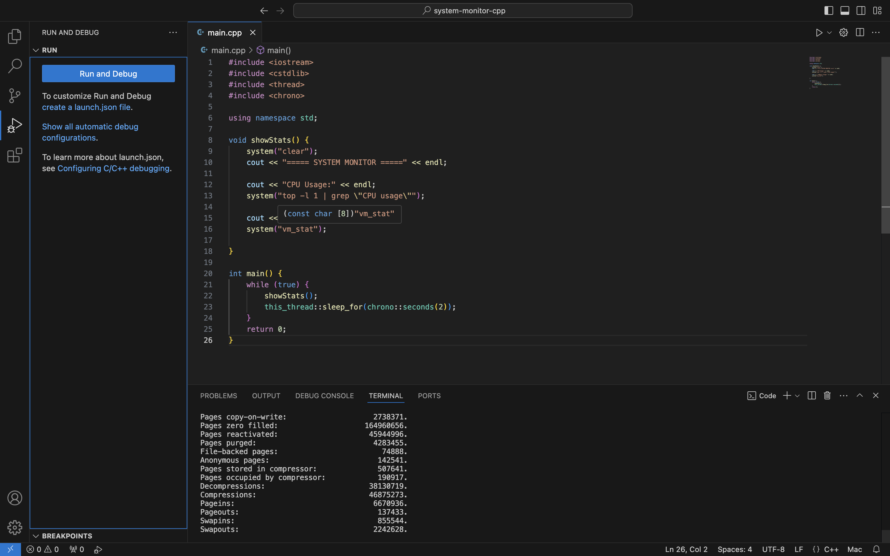

# System Monitor (C++)

Overview:
This project is a simple system monitoring tool developed using C++. It shows CPU usage and memory usage of the system in real time.

Features:
- Displays CPU usage
- Displays memory usage
- Updates continuously

Technologies Used:
- C++
- System commands (top, vm_stat)

How to Run:
1. Compile the code:
   g++ main.cpp -o monitor

2. Run the program:
   ./monitor

Output:
Output:

Author:
Riya Tulani